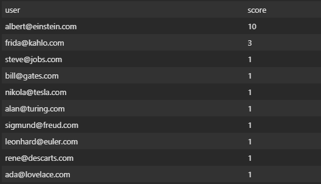

## 🔥 Let's run!

- ### **You must have...**

  -  **[Python3](https://python.org/)**
  -  **[PIP](https://pypi.org/)**
  -  **[Git](https://git-scm.com/)**

### To init server you have to create a virtual environment:
    
    $ python3 -m venv ./venv

### after create you have to init:

    $ source venv/bin/activate

### To add dependecies:
    
    $ pip install -r requirements.txt

#### To create database run:

    $ python3 manage.py migrate

#### To run:

    $ python3 manage.py runserver

## Now you have a server running on port 8000

#  Routes

- ### To create an user without recommendation:

        url:  POST /create_user/
    
    - Body

            {  
              	"name": "Albert Einstein",
                "phone_number": "31988888888",
                "email": "albert@einstein.com",
                "password": 123456,
            }

    - Response

            {
                "id": 1,
                "name": "Albert Einstein",
                "email": "albert@einstein.com",
                "phone_number": "31988888888",
                "share_url": "http://frontend.com/a57ff7c8b827122e20041d81eec0b0b6ccd4ba5b"
            }

## Now Albert Einstein have one point and a share url to invite your friends and get more points!

- ###  To create a user with recommendation:

        url:  POST /create_user/
    
    - Body

            {  
              	"name": "Steve Jobs",
                "phone_number": "31999999999",
                "email": "steve@jobs.com",
                "password": 123456,
                "token": "a57ff7c8b827122e20041d81eec0b0b6ccd4ba5b"
            }

    - Response

            {
                "id": 2,
                "name": "Steve Jobs",
                "email": "steve@jobs.com",
                "phone_number": "31999999999",
                "share_url": "http://frontend.com/c442617f7ff0a13583bb3e074f5467cd4f0c2e9e"
            }

### Now Albert Einstein get a new point and Steve Jobs get your first point and a share url"

- ### To get a CSV file with winners limited the 10 first place:

            url: GET /winners/

    - Response

    

